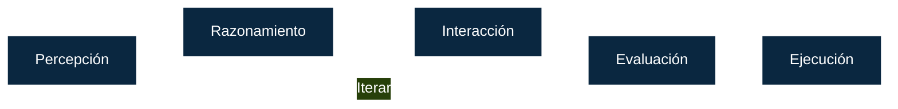
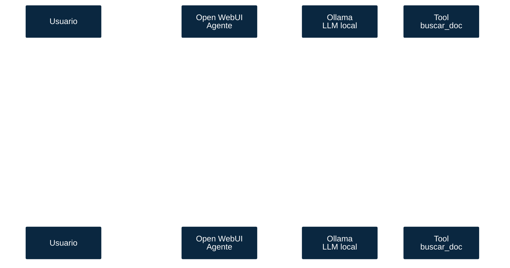

<style>
.reveal section {
  text-align: left;
}
.reveal section h1,
.reveal section h2,
.reveal section h3,
.reveal section h4 {
  text-align: center;
}
.reveal section h5 {
  text-align: right;
}

</style>

# Agente Futuro  
### Introducción

Note:
- Presentación de la serie y objetivos del taller.
- Enfatizar: enfoque práctico con stack local y privado.

---

## Agenda

1. ¿Qué es un agente?  
2. LLM vs Asistentes vs Agentes  
3. Operativa de un agente:  
   Percepción, razonamiento, interacción, evaluación, ejecución
4. Frameworks para agentes  
5. Stack: Open WebUI + Ollama + Tools  
6. Open WebUI Tools vs MCP Tools  
7. Agentes con CrewAI
8. Extender Open WebUI  

Note:
- Recalcar que hoy es visión general + fundamento para construir en la siguiente clase.

---

## ¿Qué es un agente?

Un **agente** es un sistema que percibe, razona y actúa para lograr un objetivo en su entorno.  
Sus interfaces:
- Humano-máquina: el lenguaje natural.
- Máquina-máquina: APIs (por ejemplo, MCP).

**Tipos:**
- Reactivo: responde a estímulos.
- Deliberativo: planifica y evalúa.
- Multiagente: coordina con otros agentes.

--

 
<small>Fuente: [Amit Agrahari, *Building AI Agents: A Practical Guide to the Tools & Ecosystem*](https://www.linkedin.com/pulse/building-ai-agents-practical-guide-tools-ecosystem-amit-agrahari-wdaef/).</small>

--

Os imaginais que este curso lo imparte un agente?  

--

- Guía del curso temporizada (pasando las diapositivas a un ritmo adecuado).
- Interacciones con alumnado a través de Discord
  - Preguntas a alumnos random para ver que han comprendido en contenido
  - Respuestas a preguntas planteadas.
- Resolución de preguntas con las bases de conocimiento del curso.

--

Vamos... que las profesoras y los profesores tienen los días contados 😂
 

--

¡Infinitamente mejor, ¿verdad?! 😜
 

---

## LLM vs Asistentes vs Agentes

| Concepto | Qué hace | Ejemplo |
|-----------|-----------|----------|
| **LLM** | Genera texto | [Llama](https://ollama.com/library/llama3), [Gemma](https://ollama.com/library/gemma3), [Mistral](https://ollama.com/library/mistral) |
| **Asistente** | Gestiona contexto limitado | Alexa, Siri, Google Assistant |
| **Agente** | Planifica, decide y actúa | [CrewAI](https://www.crewai.com/), [AutoGen](https://microsoft.github.io/autogen/stable/), [N8N](https://n8n.io/) |

---

## Operativa de un agente



---

### Percepción
⚙️ **Objetivo:** transformar señales crudas del entorno en datos estructurados listos para razonar.  
- Define qué observa el agente (texto, audio, métricas, APIs).  
- Traduce cada observación a un formato común.  
- Garantiza contexto actualizado y fiable.

--

#### Fuentes de datos típicas
- **Texto:** emails, tickets, chats, PDFs.  
- **Eventos digitales:** webhooks, logs, telemetría.  
- **Señales físicas:** sensores IoT, video, audio.  
- **APIs externas:** CRM, ERP, hojas de cálculo.

--

#### Limpieza y normalización
- Eliminación de ruido (stopwords, redundancias).  
- Enriquecimiento: metadatos de origen, timestamps, usuarios.  
- Clasificación o etiquetado inicial (categorías, prioridades).

--

#### Featurización y almacenamiento
- Embeddings semánticos (texto, imágenes, audio).  
- Esquemas estructurados: JSON, tablas, grafos.  
- Cachés de contexto reciente y memoria a largo plazo.

--

#### Ciclo de retroalimentación
- Monitoreo de calidad (detección de outliers, drift).  
- Anotaciones humanas donde el modelo falla.  
- Ajustes automáticos de filtros y conectores.

---

### Razonamiento
🧠 **Objetivo**: Dotar de memoria y conocimiento a los agentes para mejorar el contexto que define el problema a resolver.

--

 

--

####  Retrieval-Augmented Generation (RAG)
🔍 **Objetivo:** combinar un modelo LLM con un motor de búsqueda o base de conocimiento **externa y actualizada**.

--

**Cómo funciona:**
1. El usuario hace una pregunta.  
2. El agente busca información relevante (en vector DB, documentos, etc.).  
3. El contexto encontrado se añade al *prompt* del modelo.  
4. El modelo genera una respuesta más precisa y contextual.

--

**Aplicaciones:**
- Chatbots corporativos (manuales, documentación, FAQs)  
- Asistentes legales, técnicos o médicos  
- Consulta de datos empresariales sin exponer la base completa

💡 *Ejemplo:*  
Un agente que consulta políticas internas de una empresa antes de responder al usuario.  
[Llama index](https://developers.llamaindex.ai/python/framework-api-reference/llms/ollama/)

--

#### Knowledge-Augmented Generation (KAG)
🕸️**Objetivo:** integrar **estructuras de conocimiento preprocesadas** (ontologías, grafos, embeddings, relaciones semánticas).

--

**Diferencias con RAG:**
| Aspecto | RAG | KAG |
|----------|-----|-----|
| Fuente de información | Documentos pre-procesados | Conocimiento estructurado (grafo, triples, JSON-LD...) |
| Enfoque | Búsqueda + contexto | Razonamiento sobre relaciones |
| Ejemplo | Buscador de documentos | Asistente que infiere relaciones entre conceptos |

--

**Aplicaciones:**
- Sistemas expertos  
- Asistentes educativos o científicos  
- Agentes que deben inferir o razonar más allá del texto literal  

Libreria KAG: [GraphRAG (KAG)](https://microsoft.github.io/graphrag/)

[Embeddings projector example](https://projector.tensorflow.org/)

Note:
- Aclarar que aunque el nombre incluya RAG al tratarse de manejar informacion de forma estructurada nos estaremos refiriendo realmente a KAG.

--

#### RAG + KAG en agentes

🔍 **RAG** aporta *actualidad y contexto*.  
🧠 **KAG** aporta *razonamiento y estructura*.  

Juntos permiten construir agentes con:  
- Contexto dinámico (RAG)  
- Razonamiento simbólico (KAG)  
- Memoria persistente y conocimiento vivo  

---

### Interacción

⚙️ **Objetivo:** interactuar con su entorno a través de herramientas.  
Estas **herramientas** exponen una interfaz (función, API o servicio) que se invoca para leer datos o ejecutar operaciones.
- Encapsulan la lógica de negocio.
- Controlan permisos y límites de seguridad.
- Devuelven observaciones estructuradas al agente.

--

Algunas interfaces que se han estandarizado:
- **MCP**: protocolo estandarizado para descubrir y usar herramientas.
- **OpenAPI**: definición de endpoints HTTP que se exponen como acciones.

--

Librerias para crear herramientas:
- **Open WebUI tools**: Herramientas integradas en OWUI. Simples y para casos sencillos.
- **FastMCP**: librería ligera para publicar servidores MCP en minutos.

--

#### [Model Context Protocol](https://modelcontextprotocol.io/docs/getting-started/intro) (MCP)

- Define un contrato JSON-RPC para listar herramientas, invocarlas y transmitir recursos.
- Aísla cada servidor de herramientas en su propio proceso → mayor seguridad.
- Permite reutilizar la misma tool entre agentes, IDEs y asistentes compatibles.
- Incluye eventos de observabilidad (logs, errores, métricas).

--


--

#### OpenAPI (HTTP → Tools)

- Describe endpoints REST en un documento OpenAPI/Swagger.
- El agente genera solicitudes válidas (método, path, cuerpo) basándose en el esquema.
- Ideal para integrar servicios existentes sin reescribir lógica.
- Se puede combinar con MCP publicando un servidor que actúe como proxy de las llamadas.
[mcpo] (https://github.com/open-webui/mcpo)

--

#### FastMCP

- Microframework en Python que implementa el protocolo MCP.
- Decoradores `@tool` simplifican la exposición de funciones.
- Incluye CLI (`fastmcp run`) y hot-reload para desarrollo local.
- Permite empaquetar un set de tools y desplegarlo como contenedor ligero.

--

#### Buenas prácticas

- Validar entradas y salidas (pydantic, JSON Schema, DTOs).
- Añadir timeouts y reintentos según criticidad.
- Registrar cada llamada para trazabilidad (quién, cuándo, resultado).
- Diseñar respuestas deterministas: evita obligar al LLM a inferir campos.

--

**Ejemplos habituales:**  
- 🌐 Buscadores web.  
- 📄 explorador de documentos.
- 📊 Consulta de datos
- ☁️ Conectores S3/MinIO.

---

### Evaluación

📏 **Objetivo:** medir el resultado de las acciones y decidir si el agente debe iterar, escalar o finalizar.  
- Verifica que los outputs cumplen criterios funcionales y de calidad.  
- Detecta desviaciones respecto a reglas, políticas o KPIs.

--

**Dimensiones clave:**  
- **Exactitud:** ¿la respuesta/resolución es correcta?  
- **Tiempos:** ¿se ejecutó dentro de los SLA definidos?  
- **Coste:** consumo de recursos (tokens, CPU, llamadas externas).  
- **Satisfacción:** feedback humano o métricas de experiencia.

--

**Mecanismos de evaluación:**  
- Revisión automática con tests/reglas (contract tests, validadores).  
- Evaluación humana (*human-in-the-loop*) para casos críticos.  
- Evaluadores LLM (auto-crítica, comparación con respuestas esperadas).  
- Monitoreo continuo con dashboards y alertas.

--

**Acciones ante resultados:**  
- **OK:** registrar evidencias y cerrar el ciclo.  
- **Parcial:** recuperar contexto adicional (RAG/KAG) y reintentar.  
- **Fallo:** escalar a persona responsable o activar planes de contingencia.  
- **Aprendizaje:** actualizar prompts, herramientas o datos de soporte.

---

### Ejecución
▶️ Uso de herramientas para aplicar las acciones pertinentes.

---

### Ejemplo
#### Agente organizador de eventos
- Percepcion:
  - Revisa emails.
  - Extrae eventos.
  - Normaliza datos.

--

- Razonamiento:
  - Analiza el tipo de evento.
  - Clasifica la audiencia de este tipo de eventos.

- Interacción:
  - Crea una hoja de calculo con los asistentes potenciales.
  - Prepara un dosier para el cliente con las posibles fechas y candidatos.
  - Preparar un correo en modo draft para revisarlo.
  - Envia dosier al cliente esperando confirmacion de las fechas ofrecidas.

--

  - Envia el dosier en copia a la persona encargada de supervisar los eventos.
  - Alerta sobre cambios inesperados en la planificación.

--

- Evaluación:
  - Comprueba que las acciones sean correctas antes de que se ejecuten.
  - Si aun los resultados no son satisfactorios volvemos a iterar todo el proceso hasta que se cumpla un mínimo para aplicar las acciones.

---

## Frameworks para agentes

- **N8N** (NoCode/Py/JS): Orquestador de agentes sin necesidad de escribir código.
- **LangChain** (Py/JS): pipelines + tools  
- **CrewAI** (Py): multiagente colaborativo  
- **LlamaIndex** (Py): RAG + memoria  
- **AutoGen** (Py): patrones multiagente  
- **MCP** (Py/Go): protocolo universal de tools

--

| Framework | Foco | Nivel |
|------------|------|-------|
| LangChain | Pipelines | Medio |
| CrewAI | Multiagente | Avanzado |
| LlamaIndex | RAG | Medio |
| MCP | Integración universal | Avanzado |

Note:
- Recalcar que elegimos stack local reproducible: Open WebUI + Ollama + Tools/MCP.

---

## Stack
### Open WebUI + Ollama + Tools

```
Usuario → Open WebUI (frontend)
             ↓
    Tools (Open WebUI / MCP)
             ↓
         Ollama (LLM local)
             ↓
    Datos y Servicios (DB, S3, Email, HTTP)
```

- **Open WebUI:** interfaz moderna  
- **Ollama:** motor local (Llama, Mistral, Gemma)  
- **Open WebUI / MCP Tools:** acceso a herramientas

Note:
- Mencionar devcontainer para estandarizar entorno.

---

## Interacción 
### agente–usuario–herramienta



Note:
- Explicar cómo el agente usa el LLM para razonar y decide cuándo invocar la tool.
- Ejemplificar con tool concreta: `buscar_doc` que devuelve contexto antes de responder.

---

## Open WebUI vs MCP Tools

- Open WebUI ofrece la posibilidad de desarrollo de herramientas sencillas pero no portables.  
- MCP es un standard que permite integrar con diferentes sistemas de forma **segura, portable y reutilizable**.  

Note:
- Cuándo usar WebUI Tools (rápido/local) vs MCP (escalable/reutilizable).

---

## Extender Open WebUI

Pasos típicos:
1. Definir la herramienta (`tools/`)
2. Describir el contrato (Valves / User Valves)
3. Registrar en `tools.json`
4. Probar en WebUI

https://docs.openwebui.com/features/plugin/tools/development/

Ejemplo: http://localhost:3000/

```json
{
  "name": "ocr_image_tool",
  "description": "Extrae texto de imágenes",
  "schema": {"path": "string"},
  "handler": "tools.ocr_image:run"
}
```

Note:
- Buenas prácticas: logs, validación, timeouts y tests.

---

### Ejemplo conceptual — MCP server mínimo

```python
from fastmcp import MCPServer, tool

app = MCPServer("demo-mcp")

@tool()
def email_count(inbox: str) -> int:
    "Devuelve el número de emails en un buzón"
    return 42

if __name__ == "__main__":
    app.run()
```

Note:
- Explicar descubrimiento de tools via MCP y consumo desde Open WebUI.

---

## Roadmap del taller

- 🦙 Instalar Open WebUI + Ollama (devcontainers)
- ⚙️ Crear el primer agente con una Tool
- 📧 Conectar un MCP server (correo / S3 / DB)
- 🧠 Memoria y planificación (prompting + patterns)
- 🧪 Logs, trazas, tests y buenas prácticas

Note:
- Reforzar que veremos ejemplos reales conectados a datos locales.

---

## ¡Listos para construir!

👉 Próxima sesión: entorno de desarrollo listo.  
🎯 Objetivo: agente que usa una Tool real y ejecuta una acción medible.

Note:
- Dejar 5' para preguntas y setup de la siguiente clase.
